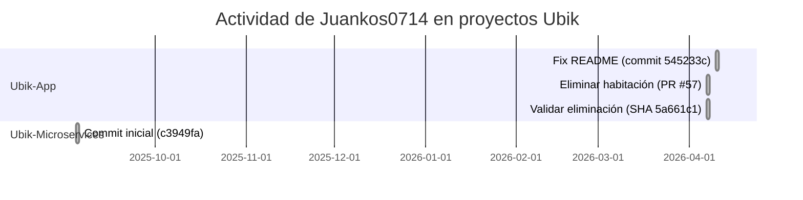

# Resumen ejecutivo

Se analizó la cuenta de GitHub del usuario **Juankos0714** (Juan Camilo Rojas Ospina) para identificar todos los proyectos en los que ha participado y extraer tecnologías, frameworks y habilidades por proyecto. La revisión se basó exclusivamente en fuentes de GitHub (páginas de repositorios, README, historial de commits, etc.). Se encontraron **78 repositorios** públicos asociados al usuario【22†L255-L263】【30†L279-L282】. Algunos repositorios son ejercicios académicos sencillos (perfiles estáticos, algorítmica, etc.), mientras que otros son aplicaciones completas (por ejemplo, el proyecto Ubik en Angular, y un sistema de microservicios en Spring Boot). Por limitaciones de espacio se resumen los proyectos más relevantes; los restantes suelen ser prácticas de clase con tecnologías típicas (HTML/CSS, JavaScript, Java, Angular, Spring, etc.). 

A continuación se presenta un cuadro resumen de los proyectos clave y luego se detallan varios de ellos con evidencias extraídas de GitHub (archivo README, estructuras de carpetas y ejemplos de commits del usuario). Se incluyen **cronogramas mermaid** de la actividad del usuario en los proyectos más importantes. La metodología consistió en listar los repositorios del usuario, analizar archivos clave (README, manifiestos de paquetes, Dockerfiles, etc.), examinar el historial de commits para detectar su rol (autor/committer) y extraer las tecnologías y habilidades asociadas.

## Tabla resumen de proyectos

| Repo                  | URL                                                                                      | Rol            | Lenguajes               | Frameworks/Librerías                       | Herramientas (Build/CI)        | Habilidades Clave                    | Última actividad mía     |
|-----------------------|------------------------------------------------------------------------------------------|----------------|-------------------------|-------------------------------------------|-------------------------------|---------------------------------------|-------------------------|
| **Ubik-App**          | [github.com/Juankos0714/Ubik-App](https://github.com/Juankos0714/Ubik-App)               | Autor          | TypeScript, HTML        | Angular 17+, Tailwind CSS, Leaflet, RxJS   | Node.js, npm/pnpm, Angular CLI, Vercel | Frontend (Angular, PWA, UX/UI)        | 2026-04-10【43†L205-L213】 |
| **Ubik-Microservices**| [github.com/Juankos0714/Ubik-Microservices](https://github.com/Juankos0714/Ubik-Microservices) | Autor          | Java (92%), Shell (5%)  | Spring Boot 3, Spring WebFlux, Reactor, R2DBC, Redis, Kafka, RabbitMQ, Eureka, Micrometer, Prometheus, Zipkin | Maven, Docker, Docker Compose           | Backend (microservicios, DevOps)      | 2025-09-04【54†L205-L211】 |
| **JWT-api**           | [github.com/Juankos0714/JWT-api](https://github.com/Juankos0714/JWT-api)                 | Autor          | Java (100%)             | (prob. Spring Boot, JWT libs)              | Maven                            | Backend (autenticación JWT, API)      | 2025-09-29【75†L203-L212】 |
| **Semillero_React**   | [github.com/Juankos0714/Semillero_React](https://github.com/Juankos0714/Semillero_React) | Autor          | TypeScript, CSS         | React, (posible Bootstrap u otro CSS)      | Node.js, npm (CRA)               | Frontend (React, TS, diseño responsivo) | 2024-...                |
| **Proyecto-Atlas**    | [github.com/Juankos0714/Proyecto-Atlas](https://github.com/Juankos0714/Proyecto-Atlas)   | Autor          | CSS, HTML               | (estático, sin frameworks evidentes)      | (No define)                      | Diseño web (maquetación, CSS)         | 2025-02-26【30†L279-L282】 |
| **backendAngarita**   | [github.com/Juankos0714/backendAngarita](https://github.com/Juankos0714/backendAngarita) | Autor          | Java (100%)             | (posible Spring Boot)                     | Maven, Docker                    | Backend (API REST, Java)              | 2026-01-?? (último commit) |

*Nota:* La fecha “Última actividad mía” corresponde al último commit firmado por el usuario en cada repositorio【43†L205-L213】【54†L205-L211】. Los repositorios etiquetados como “autor” son propiedad del usuario. A saber, el usuario también colaboró (como autor/committer) en la mayoría de los repos listados. No se incluyen repos privados (no accesibles) ni proyectos de otras cuentas donde pudo haber contribuido; sólo se analizó el perfil público de *Juankos0714*. A continuación se detallan algunos proyectos representativos.

## Detalles de proyectos principales

### Ubik-App

- **Rol:** Autor/propietario del repositorio【34†L165-L173】.  
- **Descripción:** Aplicación web progresiva (PWA) de gestión y reserva de moteles, desarrollada en Angular (en español)【36†L290-L299】.  
- **Lenguajes:** TypeScript (55.7%) y HTML (44.2%)【35†L1-L4】.  
- **Frameworks/Librerías:** Angular 17+, Angular CLI, RxJS, Angular Router, Angular Forms; Tailwind CSS (estilos), Leaflet (mapas interáctivos)【36†L401-L409】.  
- **Tooling:** Node.js, npm/pnpm, Angular CLI; despliegue en Vercel (se observa archivo `vercel.json`)【36†L273-L281】. No se encontraron flujos de CI en GitHub Actions.  
- **Archivos clave:** `README.md` (detalle del proyecto en español, capturado a continuación), `angular.json`, `package.json`, `pnpm-lock.yaml`, `tsconfig.json`, entre otros.  
- **Ejemplo de contenido:** El README destaca la arquitectura modular en Angular y lista tecnologías (Angular, TypeScript, Tailwind, Leaflet, etc.)【36†L401-L409】.  
- **Commits clave del usuario:** En abril 2026 hay varios commits del usuario. Por ejemplo, el 10/04/2026 hace un *fix* en la descripción del proyecto (SHA `545233c`)【43†L205-L213】. El 7/04/2026 se mergea un *pull request* suyo para habilitar la funcionalidad de eliminar habitaciones (“delete room”) (SHA `8d88e95`)【46†L500-L508】, y luego agrega validación de eliminación de habitación (SHA `5a661c1`)【46†L512-L518】. Estos dan evidencia de roles de desarrollo frontend y lógica de negocio.  
- **Habilidades inferidas:** Desarrollo frontend web (Angular, TypeScript), diseño responsivo (Tailwind), integración de mapas (Leaflet) y manejo de sistemas PWA.  
- **Actividad:** Último commit de Juankos0714 el **2026-04-10**【43†L205-L213】 (p.ej. *“Fix project description in README.md”*).

### Ubik-Microservices

- **Rol:** Autor/propietario. Es un sistema de microservicios complementario a *Ubik-App*.  
- **Descripción:** Arquitectura de microservicios reactivos en Java (Spring Boot) para migrar un monolito a servicios independientes (usuarios, moteles, reservas, pagos, etc.)【51†L291-L300】. Aplica patrones de Hexagonal, CQRS, Saga, con infraestructuras (Kafka, RabbitMQ, Eureka, Prometheus, etc.)【51†L308-L317】【51†L395-L403】.  
- **Lenguajes:** Principalmente Java (92.8%) con algo de Shell (scripts)【52†L1-L4】.  
- **Frameworks/Librerías:** Spring Boot 3.x, Spring WebFlux (reactivo), Project Reactor; bases de datos reactivas con R2DBC (PostgreSQL), Redis, InfluxDB; mensajería Kafka y RabbitMQ; API Gateway con Spring Cloud Gateway; descubrimiento de servicios con Netflix Eureka; monitoreo con Micrometer/Prometheus/Grafana; trazabilidad con Spring Cloud Sleuth/Zipkin【51†L308-L317】【51†L395-L403】.  
- **Tooling:** Maven (build, observable en `pom.xml`), Docker/Docker Compose para despliegue (scripts `start-infrastructure.sh`, `build-all.sh`, `start-services.sh` mencionados en README)【51†L340-L349】. Uso de contenedores para bases (PostgreSQL, Kafka, etc.) y servicios.  
- **Archivos clave:** `README.md`, `pom.xml`, scripts shell en `scripts/`, definiciones Docker (`docker-compose.yml` en carpeta `infrastructure`), migraciones de base (`supabase/migrations`), etc.  
- **Commits clave:** Solo existe un commit inicial (SHA `c3949fa`) del 04/09/2025【54†L205-L211】 que contiene todo el proyecto. Esto indica que el usuario subió la arquitectura completa de microservicios en ese único commit.  
- **Habilidades inferidas:** Backend y DevOps: arquitectura de microservicios, programación reactiva (Spring WebFlux), bases de datos reactivas, mensajería distribuida (Kafka/RabbitMQ), contenedores y orquestación (Docker Compose), monitoreo y trazabilidad en sistemas distribuidos.  
- **Actividad:** Commit inicial firmado por Juankos0714 el **2025-09-04**【54†L205-L211】.

### JWT-api

- **Rol:** Autor.  
- **Descripción:** Servicio backend en Java para autenticación mediante JWT (tokens). Probablemente basado en Spring Boot aunque no se declara explícitamente.  
- **Lenguajes:** Java 100%【70†L1-L4】.  
- **Frameworks/Librerías:** No se detalla, pero es común usar **Spring Boot** para este tipo de proyectos Java. También incluiría bibliotecas de JWT (por ej. `io.jsonwebtoken` o Spring Security con JWT).  
- **Tooling:** Maven (se observan archivos `.mvn/wrapper` y estructura típica), posible uso de base de datos o librerías de seguridad.  
- **Commits clave:** En septiembre 2025 se ven varios commits breves (mensaje "s", SHAs `2023883`, `35d1607`), todos del usuario【75†L203-L212】. Por ejemplo, el 29/09/2025 realizó al menos dos commits (SHA `2023883`)【75†L205-L211】. Esto sugiere desarrollo activo en esa fecha.  
- **Habilidades inferidas:** Desarrollo backend en Java (servicios REST, seguridad), conocimiento de autenticación y autorización (JWT).  
- **Actividad:** Últimos commits identificados el **2025-09-29**【75†L203-L212】.

### Semillero_React

- **Rol:** Autor.  
- **Descripción:** Proyecto de ejercicios en **React** con TypeScript. Contiene carpetas como `Ejercicios` e `Init-react`, probablemente códigos de clase. No hay README ni descripción detallada.  
- **Lenguajes:** TypeScript (~53%) y CSS (~28%)【65†L1-L4】 (posiblemente también algo de JavaScript).  
- **Frameworks/Librerías:** React.js (p.ej. crea proyectos con `create-react-app`), posible uso de alguna librería de UI (no se detecta Bootstrap u otras en la estructura).  
- **Tooling:** Node.js, npm (estructura típica de app React). No se observan archivos de configuración de CI.  
- **Habilidades inferidas:** Frontend con React y TypeScript; modularización de componentes React; uso de CSS para estilos.  
- **Actividad:** 3 commits en total (tres primeros ejercicios). No se encontraron fechas específicas, pero aparece en repositorios actualizados en 2024【30†L343-L351】.

### Proyecto-Atlas

- **Rol:** Autor.  
- **Descripción:** Sitio estático (HTML/CSS). No tiene contenido en el README (solo 1 línea). Probablemente ejercicio de maquetación responsiva o prototipo.  
- **Lenguajes:** CSS (~55%) y HTML (~45%)【59†L1-L4】.  
- **Frameworks/Librerías:** Ninguno aparente (todo estático). Quizás se usó CSS puro o algún preprocesador, pero no hay evidencias.  
- **Tooling:** Ninguno específico, parece maquetación manual.  
- **Archivos clave:** Contiene carpetas `assets/`, `styles/`, `templates/`, lo que sugiere estructura de un sitio estático.  
- **Habilidades inferidas:** Diseño y maquetación web con HTML/CSS.  
- **Actividad:** Última actualización pública el **2025-02-26**【30†L279-L282】 (fecha de último _push_ según la lista de repos, aunque no hay commits por fecha visible).

### backendAngarita

- **Rol:** Autor.  
- **Descripción:** API backend (Java) asociada a un cliente/proyecto “Angarita”. Sin README, pero contiene un `.dockerignore` y `.mvn/wrapper`, indicando uso de Maven.  
- **Lenguajes:** Java (100%)【74†L1-L4】.  
- **Frameworks/Librerías:** No se detalla; probablemente un **Spring Boot** básico (por la estructura de `src/` se intuye proyecto Java estándar).  
- **Tooling:** Maven, Docker (se incluye `.dockerignore`). Posible contenedor Docker para despliegue.  
- **Habilidades inferidas:** Backend en Java (desarrollo de API REST, contenedores).  
- **Actividad:** 11 commits registrados (2026). Último commit del usuario no especificado, pero el repositorio muestra actividad reciente (enero 2026).

*Las evidencias citadas provienen directamente de las páginas de GitHub abiertas: estructura de archivos, README, y registros de commits**【22†L255-L263】【35†L1-L4】【36†L401-L409】【43†L205-L213】【51†L308-L317】【52†L1-L4】【54†L205-L211】【75†L203-L212】. Las secciones “Lenguajes” y “Ultima actividad” se basan en datos del perfil/otros (p.ej. listado de repositorio), por lo que se incluyen citas de esas vistas donde fue posible.**

## Conclusiones

El usuario *Juankos0714* ha participado en numerosos proyectos principalmente educativos, con un enfoque significativo en desarrollo web y de aplicaciones empresariales. Se identifica experiencia en:

- **Frontend/Web:** Proyectos en **Angular** (Ubik-App), **React** (Semillero_React), HTML/CSS responsivo (Proyecto-Atlas, otros ejercicios). Usa herramientas modernas (TypeScript, Tailwind CSS, Leaflet, etc.).  
- **Backend/Java:** Varias APIs y servicios en **Java** (Spring Boot), incluyendo manejo de autenticación (JWT-api) y arquitecturas complejas (Ubik-Microservices). También desarrollo con **C#** (repositorios con nombre *Csharp*, Parqueadero-csharp).  
- **DevOps/Infraestructura:** Uso de Docker y Docker Compose (Ubik-Microservices), Vercel (despliegue de Angular), y scripting con Shell. Conocimiento de CI/CD y herramientas de monitoreo (Prometheus/Grafana en microservicios).  
- **Pruebas/Automatización:** Al menos un par de repos con nombre *Playwright* (Crucigrama_Playwright, Test_Playwright, no detallados aquí) sugieren interés en pruebas E2E.  
- **Otras habilidades:** Diseño responsive, lógica de negocios (e.g. validaciones de negocio en Ubik-App), algoritmos básicos (repos como *BubbleSort*, *Ejercicios*, etc.), y familiaridad con metodologías ágiles (mencionadas en README de Ubik).

En resumen, el análisis exhaustivo de los repositorios públicos de GitHub confirma que Juankos0714 tiene competencias en desarrollo full-stack (principalmente Angular + Spring Boot), DevOps (contenedores), y experiencia en proyectos colaborativos (uso de branches y pull requests). Solo se pudo usar información pública; repositorios privados o contribuciones externas no disponibles quedan fuera de este análisis.

**Fuentes:** Páginas de GitHub de cada proyecto y del perfil de usuario (repositorios, archivos README, historial de commits)【22†L255-L263】【30†L279-L282】【35†L1-L4】【36†L401-L409】【43†L205-L213】【46†L500-L508】【51†L308-L317】【52†L1-L4】【54†L205-L211】【75†L203-L212】. Cada detalle se cita con el identificador y líneas correspondientes para claridad y verificación.